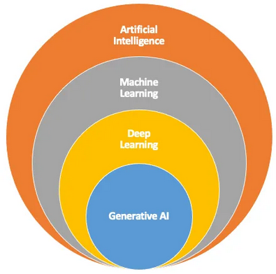
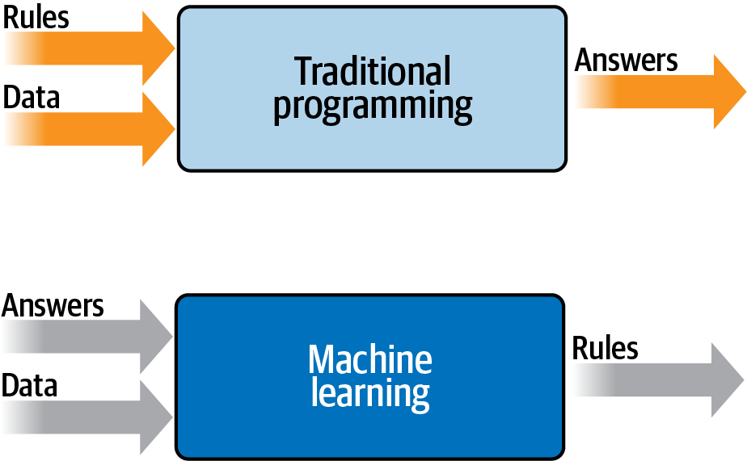

# **Part 0: Introduction to Data and Datasets for ML and LLMs**

In the ever-evolving field of **Artificial Intelligence (AI)**, **data** serves as the foundation upon which all intelligent systems are built. Whether it’s a simple decision tree or a state-of-the-art **Large Language Model (LLM)**, **high-quality, well-structured datasets** are the key drivers of performance. Today, we’ll explore **why data is indispensable, how it powers Machine Learning (ML) models, and its critical role in training and fine-tuning LLMs**.

---

### **AI, ML, and the Evolution of LLMs**

To appreciate the importance of datasets, it’s helpful to understand **where LLMs fit within the AI landscape**:

1. **Artificial Intelligence (AI)** – The broadest category, encompassing all systems designed to simulate human intelligence.  
2. **Machine Learning (ML)** – A subset of AI, where models learn from data rather than being explicitly programmed.  
3. **Neural Networks (NN)** – A subset of ML, inspired by the human brain, capable of learning complex patterns.  
4. **Deep Learning (DL)** – A subset of NN that leverages multi-layered architectures to achieve state-of-the-art performance.  
5. **Generative AI** – A branch of DL focused on generating new data, including text, images, and audio.  
6. **Large Language Models (LLMs)** – Specialized deep learning models trained on vast amounts of text to understand and generate human-like language (e.g., ChatGPT, Bing Copilot).  

<!--  -->

Unlike traditional programming—where rules are explicitly defined—**ML systems infer patterns from vast amounts of data**. This makes **the quality, diversity, and volume of data** critical to their success. Without **high-quality datasets**, even the most sophisticated models fail to generalize well and produce meaningful results.

<!--  -->

---

### **Why Data Matters in ML and LLMs**

Every ML model relies on data to:
- **Learn patterns** – Identify relationships between inputs and outputs.
- **Generalize** – Apply learned patterns to unseen examples.
- **Improve over time** – Adapt to new information through fine-tuning.

For **LLMs**, the role of data is even more pronounced:
- **Pretraining** – Models are trained on massive datasets containing text from books, articles, and code repositories.
- **Fine-tuning** – Domain-specific data refines a model’s understanding of specialized topics (e.g., legal, medical, or scientific text).
- **Reinforcement Learning from Human Feedback (RLHF)** – Improves responses based on human preferences and corrections.

Without **structured, diverse, and well-curated datasets**, even the most powerful architectures struggle with **bias, misinformation, and hallucinations**. Understanding data is critical to ensuring that models are effective, ethical, and reliable.

---

### **The Power of Open-Source LLMs**

By leveraging **open-source LLMs** such as [Sky-T1](https://github.com/NovaSky-AI/SkyThought), [Open-R1](https://github.com/huggingface/open-r1), and [OLMo 2](https://allenai.org/blog/olmo2-32B), we unlock significant advantages:
- **Transparency** – Understand exactly how models are trained and adjusted.
- **Cost-Effectiveness** – Avoid expensive licensing fees.
- **Customization** – Fine-tune models on specific datasets for tailored performance.
- **Community Collaboration** – Benefit from innovations shared across the global AI community.

For example, imagine customizing an open-source LLM like Sky-T1 to analyze legal documents or tailor DeepSeek-R1 to identify scientific breakthroughs in medical research. These tools empower individuals and organizations to address domain-specific challenges with precision.

However, to fully leverage these benefits, **we must first understand the data that powers these systems**.

---

### **What to Expect in Today’s Lecture**

The session will be divided into two key parts:
1. **Part 1** – Understanding datasets for classical ML models and how to prepare them.
2. **Part 2** – Exploring the unique challenges and requirements for datasets used in LLMs.

By the end of today's lecture, you’ll have a **good understanding of how datasets shape AI and ML models**, setting the stage for future deep dives into **training, fine-tuning, and evaluating LLMs**.

